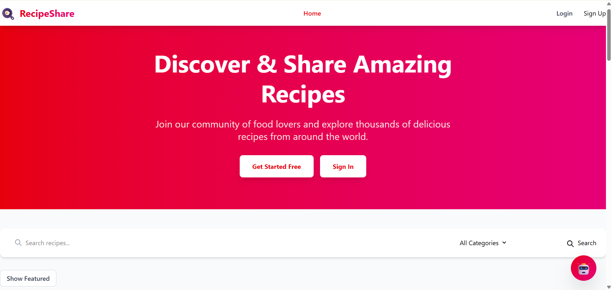

# 🍳 Recipe Sharing Platform - Frontend

A modern, responsive recipe sharing web application where users can discover, create, and share their favorite recipes with a vibrant community of food enthusiasts.



---

## 📖 Project Description

The Recipe Sharing Platform is a full-stack web application that enables users to:

- **Discover** thousands of delicious recipes from around the world
- **Create & Share** your own culinary masterpieces
- **Search & Filter** recipes by ingredients, categories, and more
- **AI Cooking Assistant** - Get instant recipe suggestions based on available ingredients
- **Admin Dashboard** - Manage users, moderate content, and feature exceptional recipes

Built with modern web technologies, this platform offers a seamless user experience with beautiful UI, real-time interactions, and intelligent features powered by AI.

---

## ✨ Features

### 🔐 User Authentication
- Secure user registration and login with JWT authentication
- Password hashing with bcrypt for security
- Protected routes and role-based access control
- Persistent sessions with localStorage

### 🍽️ Recipe Management
- **Create Recipes** - Easy-to-use form with image upload support
- **Edit Recipes** - Update your recipes anytime
- **Delete Recipes** - Remove recipes you no longer want to share
- **My Recipes** - View all your created recipes in one place
- **Recipe Details** - Beautiful detailed view with ingredients and instructions

### 🔍 Search & Discovery
- **Smart Search** - Search by recipe name, ingredients, or description
- **Category Filter** - Browse by Breakfast, Lunch, Dinner, Dessert, and more
- **Featured Recipes** - Curated collection of top recipes
- **Responsive Grid** - Beautiful card-based layout

### 🤖 AI Cooking Assistant
- **Floating Chatbot** - Always accessible from any page
- **Ingredient-Based Suggestions** - Get recipe ideas based on what you have
- **Full Recipe Details** - Complete instructions for 7+ dishes
- **Generic Fallback** - Smart responses for any ingredient
- **Cooking Tips** - Get help with techniques, timing, and substitutions

### 👑 Admin Dashboard (Admin Only)
- **User Management** - View, delete, and manage user roles
- **Recipe Moderation** - Delete inappropriate content
- **Featured Recipes** - Mark exceptional recipes as featured
- **Platform Statistics** - View user counts, recipe stats, and activity
- **Role-Based Access** - USER, MODERATOR, ADMIN roles

### 📱 Responsive Design
- Mobile-first approach
- Beautiful gradients and animations
- Smooth transitions and hover effects
- Optimized for all screen sizes (mobile, tablet, desktop)

### 🎨 Beautiful UI/UX
- Tailwind CSS with custom components
- Gradient backgrounds and shadows
- Animated elements and loading states
- Intuitive navigation and user flow

---

## 🛠️ Tech Stack Used

### Core Framework:
- **React** (v18.2+) - UI library for building component-based interfaces
- **Vite** (v5.0+) - Next-generation frontend build tool (fast HMR)

### Routing & State Management:
- **React Router DOM** (v6.21+) - Client-side routing
- **Context API** - Global state management for authentication

### Styling:
- **Tailwind CSS** (v3.4+) - Utility-first CSS framework
- **PostCSS** & **Autoprefixer** - CSS processing

### HTTP Client:
- **Axios** (v1.6+) - Promise-based HTTP client for API calls

### Development Tools:
- **ESLint** - Code linting and quality
- **Vite Dev Server** - Hot module replacement (HMR)

---

## 📁 Project Structure
```
client/
├── public/
│   └── vite.svg
├── src/
│   ├── components/
│   │   ├── layout/
│   │   │   ├── Navbar.jsx
│   │   │   ├── Footer.jsx
│   │   │   └── Layout.jsx
│   │   ├── auth/
│   │   │   ├── ProtectedRoute.jsx
│   │   │   └── AdminRoute.jsx
│   │   ├── recipes/
│   │   │   ├── RecipeCard.jsx
│   │   │   ├── RecipeList.jsx
│   │   │   ├── RecipeDetail.jsx
│   │   │   ├── RecipeForm.jsx
│   │   │   └── SearchBar.jsx
│   │   ├── admin/
│   │   │   ├── AdminDashboard.jsx
│   │   │   ├── UserManagement.jsx
│   │   │   ├── RecipeModeration.jsx
│   │   │   └── StatsCard.jsx
│   │   ├── ai/
│   │   │   └── AIChatbot.jsx
│   │   └── common/
│   │       ├── LoadingSpinner.jsx
│   │       └── ErrorMessage.jsx
│   ├── pages/
│   │   ├── Home.jsx
│   │   ├── Login.jsx
│   │   ├── Register.jsx
│   │   ├── MyRecipes.jsx
│   │   ├── CreateRecipe.jsx
│   │   ├── EditRecipe.jsx
│   │   ├── RecipeDetailPage.jsx
│   │   └── AdminPage.jsx
│   ├── context/
│   │   └── AuthContext.jsx
│   ├── services/
│   │   └── api.js
│   ├── utils/
│   │   └── helpers.js
│   ├── App.jsx
│   ├── main.jsx
│   └── index.css
├── .env
├── vite.config.js
├── package.json
└── README.md
```

---

## ⚙️ Installation Steps

### Prerequisites:
- Node.js (v18 or higher)
- npm or yarn
- Backend API running (see [Backend Repository](https://github.com/HimajahnaviKanagala/Recipe-Sharing-Platform-BE-))

### Step 1: Clone Repository
```bash
git clone https://github.com/yourusername/recipe-frontend.git
cd recipe-frontend
```

### Step 2: Install Dependencies
```bash
npm install
```

### Step 3: Configure Environment Variables

Create `.env` file in root directory:
```env
# Backend API URL
VITE_API_URL=http://localhost:5000

# Or use deployed backend
# VITE_API_URL=https://your-backend.onrender.com
```

**Note:** Make sure your backend server is running at the specified URL.

### Step 4: Run Development Server
```bash
npm run dev
```

Application will start at `http://localhost:5173`

### Step 5: Build for Production
```bash
npm run build
```

Production-ready files will be in `dist/` folder.

---

## 🚀 Deployment

### Deploy to Vercel 

1. **Push to GitHub:**
```bash
git add .
git commit -m "Initial commit"
git push origin main
```

2. **Deploy to Vercel:**
   - Go to [vercel.com](https://vercel.com)
   - Click "New Project"
   - Import your GitHub repository
   - Configure:
     - **Framework Preset:** Vite
     - **Root Directory:** `./` (or `client/` if monorepo)
     - **Build Command:** `npm run build`
     - **Output Directory:** `dist`

3. **Add Environment Variables:**
   - Go to Settings → Environment Variables
   - Add: `VITE_API_URL` = `https://your-backend.onrender.com`

4. **Deploy:**
   - Click "Deploy"
   - Wait for deployment (1-2 minutes)
   - Get deployment URL

---

## 🔗 Deployment Link

**Live Application:** https://recipe-sharing-platform-fe-vui4.vercel.app/

---

## 🔌 Backend API Link

**Backend Repository:** https://github.com/HimajahnaviKanagala/Recipe-Sharing-Platform-BE-

**API Base URL:** 
- Development: `http://localhost:5000/api`
- Production: `https://recipe-sharing-platform-be-2-obn9.onrender.com/api/recipes`

**API Documentation:** See backend README for full API endpoints and usage.

---

## 🔑 Login Credentials

### Demo User Account:
```
Email: demo@example.com
Password: demo123
Role: USER
```

### Demo Admin Account:
```
Email: admin@example.com
Password: admin123
Role: ADMIN
```

**Note:** These are demo credentials for testing purposes. In production, please create your own account.

### Creating Your Own Admin Account:

1. Register a new account through the app
2. Go to your Supabase dashboard
3. Navigate to: Table Editor → users
4. Find your user and change `role` to `ADMIN`
5. Refresh the app

---

## 📸 Screenshots

### 1. Homepage


*Beautiful landing page with featured recipes and search functionality*

---

### 2. Login Page


*Secure authentication with gradient background*

---

### 3. Register Page


*User-friendly registration form with validation*

---

### 4. My Recipes


*Personal dashboard showing all user-created recipes*

---

### 5. Recipe Detail Page


*Comprehensive recipe view with ingredients and instructions*

---

### 6. Create Recipe


*Intuitive form for adding new recipes*

---

### 7. AI Chatbot


*Floating chatbot providing recipe suggestions and cooking tips*

---

### 8. Admin Dashboard


*Comprehensive admin panel with statistics and user management*

---

### 9. User Management (Admin)


*Admin interface for managing users and roles*

---

### 10. Recipe Moderation (Admin)


*Admin tools for moderating and featuring recipes*

---

### 11. Mobile Responsive


*Fully responsive design optimized for mobile devices*

---

## 📈 Future Enhancements

- [ ] Social features (like, comment, share)
- [ ] Recipe ratings and reviews
- [ ] Bookmark/favorite recipes
- [ ] Shopping list generator
- [ ] Meal planning calendar
- [ ] Nutrition information
- [ ] Recipe scaling calculator
- [ ] Print-friendly recipe cards
- [ ] Social media integration
- [ ] Multi-language support
- [ ] Dark mode
- [ ] Progressive Web App (PWA)

---

**Built with ❤️ and lots of ☕ for food lovers everywhere! 🍳**

---

**⭐ If you found this project helpful, please give it a star!**
